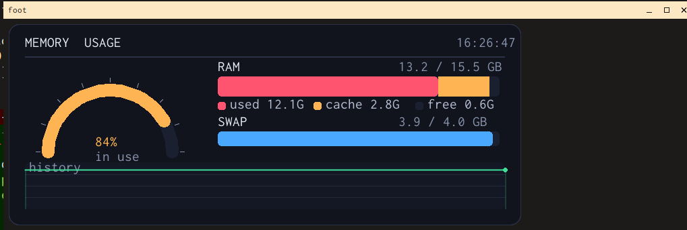

# Vector graphics protocol

foot can draw vector primitives — lines, shapes, curves and text — directly in
the terminal. Drawing commands are sent as a single DCS escape sequence; foot
rasterizes them into an image and places it at the cursor, reusing the sixel
image pipeline. The result therefore behaves like any image: it scrolls with the
text and is erased when the cells beneath it are overwritten.

## Enabling

Enabled by default. It can be turned off with the `graphics` tweak in
`foot.ini`:

```ini
[tweak]
graphics=no
```

## The escape sequence

```
ESC P > g <commands> ESC \
```

- `ESC P` (`\033P`) — DCS introducer
- `> g` — selects the graphics protocol
- `<commands>` — the drawing program (see below)
- `ESC \` (`\033\\`) — String Terminator; the image is drawn when this is received

The body is a list of commands, one per command, separated by **newlines or
commas**. A comma lets you put a whole drawing on one line — handy for a single
`printf`. Each command is the command name followed by its arguments, separated
by spaces.

A `#` starts a comment that runs to the end of the line. The `text` command
takes the rest of its line as the string to draw; both comments and `text`
strings ignore commas (so a comma there is literal, not a separator).

## Coordinates and colors

- **Coordinates are pixels**, with the origin `(0,0)` in the **top-left** corner
  of the canvas. The y axis points **down**.
- **The canvas size is given in terminal cells** (`size <cols> <rows>`), so it
  lines up with the character grid. The pixel dimensions are
  `cols x cell_width` by `rows x cell_height`.
- **Colors** are written as:
  - `#rrggbb` — opaque
  - `#rrggbbaa` — with alpha (`00` transparent, `ff` opaque)
  - `none` — fully transparent

Alpha is blended over whatever is already on the canvas (source-over). Filled
shapes are intended for opaque colors; overlapping translucent fills may show
seams where coverage overlaps.

## Command reference

| Command | Description |
|---|---|
| `size <cols> <rows>` | Canvas size, in terminal **cells**. Must be the first command. |
| `bg <color>` | Fill the canvas background (default: `none`). |
| `pen <color>` | Set the current drawing color. |
| `thickness <n>` | Line/outline thickness in pixels (default `1`). |
| `clip <x> <y> <w> <h>` | Restrict subsequent drawing to a rectangle. |
| `noclip` | Remove the clip rectangle. |
| `clear` | Reset the whole canvas to the background color. |
| `pixel <x> <y>` | Plot a single point. |
| `line <x0> <y0> <x1> <y1>` | Draw a line. |
| `rect <x> <y> <w> <h>` | Rectangle outline. |
| `rectf <x> <y> <w> <h>` | Filled rectangle. |
| `rrect <x> <y> <w> <h> <r>` | Rounded-rectangle outline, corner radius `r`. |
| `rrectf <x> <y> <w> <h> <r>` | Filled rounded rectangle. |
| `circ <cx> <cy> <r>` | Circle outline. |
| `circf <cx> <cy> <r>` | Filled circle. |
| `arc <cx> <cy> <r> <start> <end>` | Circular arc outline. Angles in degrees (see below). |
| `tri <x0> <y0> <x1> <y1> <x2> <y2>` | Triangle outline. |
| `trif <x0> <y0> <x1> <y1> <x2> <y2>` | Filled triangle. |
| `poly <x0> <y0> <x1> <y1> ...` | Closed polygon outline. |
| `polyf <x0> <y0> <x1> <y1> ...` | Filled polygon (even-odd rule). |
| `bezier <x0> <y0> <x1> <y1> <x2> <y2> <x3> <y3>` | Cubic Bézier curve. P0/P3 are endpoints, P1/P2 are control points. |
| `text <x> <y> <string>` | Draw UTF-8 text; `x y` is the left end of the baseline. The string is the rest of the line. Uses the configured font. |

### Arc angles

Angles are in **degrees**, measured clockwise (because the y axis points down):

```
        270 (north / up)
          |
180 ------+------ 0 / 360  (east / right)
(west)    |
         90 (south / down)
```

`arc 100 100 40 0 90` draws the quarter from east round to south.

## Examples

A filled rounded rectangle, a circle outline and a label:

```sh
printf '\033P>g
size 20 6
bg #101028
pen #ff5050
rrectf 10 10 130 50 12
pen #50d0ff
circ 220 35 28
pen #ffffff
text 12 90 hello
\033\\'
```

Drawing with alpha:

```sh
printf '\033P>g
size 16 6
bg #202040
pen #ff000080
rectf 10 10 120 60
pen #00ff0080
rectf 60 20 120 60
\033\\'
```

A self-contained demo lives in [`draw-demo.sh`](../shoescripts/draw-demo.sh) at the repo
root:

```sh
./bld/debug/foot sh shoescripts/draw-demo.sh
```

### Welcome banner

[`welcome.sh`](../shoescripts/welcome.sh) draws a polished gradient header — a good login
or shell-startup banner. It renders a fixed-size "card" on a transparent
canvas, so it looks the same regardless of your font size. Edit the `TITLE`
and `SUBTITLE` variables at the top.

```sh
./bld/debug/foot sh shoescripts/welcome.sh
```

To show it every time a shell starts, add to `~/.bashrc` or `~/.zshrc`:

```sh
sh /home/mark/Projects/foot/shoescripts/welcome.sh
```

### shoestring — beautify any string

[`shoestring`](../shoescripts/shoestring) turns a piped string into a banner, picking a
random theme and decorative motif each run:

```sh
echo "ship it" | shoestring
shoestring "Deploy Complete"
printf 'Big Title\na small subtitle\n' | shoestring   # 1st line title, rest subtitle
```

The card auto-sizes to the text. The chosen theme name is printed to stderr.
Force a theme with `SHOESTRING_THEME=0..6` (0 Aurora, 1 Ocean, 2 Sunset,
3 Forest, 4 Ember, 5 Grape, 6 Slate). If the text overflows or sits too far
from the right edge, tune the `charw` estimate near the top of the script to
match your font's glyph width.

Graphics are only emitted when stdout is a graphics-capable terminal (foot);
otherwise `shoestring` prints plain text — so it stays usable when piped to a
file or another program, or run in a different terminal:

```sh
echo "ship it" | shoestring > log.txt    # writes plain text, no escapes
```

Override the detection with `SHOESTRING_FORCE=1` (always draw) or
`SHOESTRING_PLAIN=1` (always plain).

### shoebling — frame a string in an ornate vintage border

[`shoebling`](../shoescripts/shoebling) wraps your text in a "vintage frame": a parchment
panel with a double keyline border, scrollwork in each corner, centre crests on
the top and bottom edges, and filigree dividers above and below the title — all
built from `bezier`/`arc`/`poly`/`circ` primitives (no gradient).

```sh
echo "VINTAGE FRAME" | shoebling
shoebling "Deploy Complete"
printf 'VINTAGE FRAME\nORIGINAL\nEST. 1967\n' | shoebling   # title / kicker / footer
```

It takes 1–3 stdin lines: line 1 is the **title** (big, centred, upper-cased and
letter-spaced for an engraved look), line 2 the **kicker** (small line above the
top flourish) and line 3 the **footer** (below the bottom flourish). With only
two lines the second is treated as the footer; passing arguments uses them all
as the title. The frame auto-sizes to the longest line via the `ESC[16t`
cell-size query.

A random vintage theme is chosen each run (name printed to stderr); force one
with `SHOEBLING_THEME=0..5` (0 Sepia, 1 Noir, 2 Royal, 3 Botanic, 4 Bordeaux,
5 Slate). `SHOEBLING_INVERT=1` flips to a dark panel with light scrollwork;
`SHOEBLING_CAPS=0` keeps the original case and `SHOEBLING_SPACE=0` disables the
title letter-spacing. As with shoestring, graphics are only emitted to a
graphics-capable terminal — otherwise it prints a plain-text ASCII frame — and
`SHOEBLING_FORCE=1` / `SHOEBLING_PLAIN=1` override the detection.

### shoelace — chart any dataset

[`shoelace`](../shoescripts/shoelace) reads a dataset on stdin and draws a **bar**, **line**
or **pie** chart on the same gradient "card" as shoestring:

```sh
echo "Mon,3
Tue,7
Wed,5" | shoelace bar "Weekly visits"
shoelace pie  "Budget" < spend.csv
printf 'a,1\nb,4\nc,2\n' | shoelace line
```

The first argument selects the chart type (`bar` | `line` | `pie`, default
`bar`, or set `SHOELACE_TYPE`); the rest is the title. The input format is
auto-detected:

- **CSV** — one `label,value` per line. Blank lines and `#` comments are
  ignored, a leading non-numeric header row (e.g. `label,value`) is dropped, and
  non-numeric rows are skipped.
- **JSON** — input beginning with `{` or `[`. Recognised shapes:

  ```sh
  echo '{"Mon":3,"Tue":7}'                      | shoelace        # object map
  echo '[{"label":"a","value":12},{"x":"b","y":8}]' | shoelace    # array of objects
  echo '[["Mon",3],["Tue",7]]'                  | shoelace line   # [label,value] pairs
  echo '[3,7,5,4,8]'                            | shoelace pie    # bare numbers (labels 1..N)
  ```

  For arrays of objects the label key is one of
  `label`/`name`/`title`/`x`/`key`/`category`/`id` and the value key one of
  `value`/`val`/`y`/`count`/`amount`/`total`/`n` (falling back to the first
  string/number field). The JSON parser is dependency-free (pure `awk`).

The card auto-sizes to the data; series are coloured from a fixed categorical
palette and the card theme is chosen like shoestring (`SHOELACE_THEME=0..6`).
As with shoestring, graphics are only emitted to a graphics-capable terminal —
otherwise `shoelace` prints a plain-text ASCII bar chart, so it stays usable
when piped to a file. Override with `SHOELACE_FORCE=1` / `SHOELACE_PLAIN=1`.

Limitations: assumes non-negative numeric values, a single series, and does not
rotate labels (long category labels are truncated).

### memtop — live memory dashboard

[`memtop.sh`](../shoescripts/memtop.sh) is a live memory-usage dashboard that re-renders a
fixed-size "card" in place every interval, so it looks the same regardless of
your font/cell size. It reads `/proc/meminfo` and shows a half-ring
"speedometer" of `% RAM in use`, stacked bars breaking RAM (used / cache / free)
and swap down, and an area graph tracking the usage history.



```sh
./bld/debug/foot sh shoescripts/memtop.sh        # live, 1s refresh
./bld/debug/foot sh shoescripts/memtop.sh 2      # live, 2s refresh
./bld/debug/foot sh shoescripts/memtop.sh once   # draw a single frame and exit
```

Press `q` or `Ctrl-C` to quit the live view. It queries the real cell size with
`ESC[16t` (falling back to ~8×16 px) so it reserves just enough rows/cols for
the card.

The `once` mode draws one frame at the cursor and returns without clearing the
screen or hijacking the cursor, so it can be dropped into `welcome.sh` or a
shell-startup banner.

### slippers — interactive file explorer

[`slippers`](../shoescripts/slippers) is a dual-pane,
Midnight-Commander-style file browser drawn entirely with the vector-graphics
protocol and driven by both keyboard **and mouse**. It is the first *interactive*
shoescript (and the first written in Python): every frame is one
comma-delimited drawing program redrawn over itself at the home position, just
like `memtop.sh` refreshes its card.

```sh
./bld/debug/foot sh -c 'python3 shoescripts/slippers'   # or, on PATH inside foot:
slippers [start-dir]
```

Two panes show sorted directory listings (`..` first, then folders, then files;
folder / executable / file icons and type colours). Keys:

| Key | Action |
|---|---|
| Up / Down / PgUp / PgDn / Home / End | move the selection |
| Tab | switch the active pane |
| Enter / → | open a directory (or show file info) |
| Backspace / ← | go to the parent directory |
| F1 | help · F3 view · F5/F6/F7/F8 copy/move/mkdir/delete |
| F10 / q | quit |

**Mouse** (SGR-pixel reports, `ESC[?1002h ESC[?1006h ESC[?1016h`): the pixel
coordinates line up 1:1 with the canvas, so clicking a row selects it and
activates its pane, double-clicking a directory opens it, the wheel scrolls,
and clicking the function-key bar fires that action.

It queries the real cell size with `ESC[16t` and fills the whole terminal, and
restores the screen (alt-screen, cursor, mouse modes) cleanly on exit. v1 is
**navigate + view**: the destructive operations (copy/move/mkdir/delete) draw a
confirmation dialog but do not yet touch the filesystem. As with the other shoe
tools it only runs on a graphics-capable terminal (`SLIPPERS_FORCE=1` /
`SLIPPERS_PLAIN=1` override the detection).

## Notes and limitations

- The image is placed at the current cursor position and scrolls with the
  terminal, exactly like a sixel.
- Shapes are not anti-aliased; text is (via the font rasterizer).
- A malformed or incomplete command is skipped; foot does not abort the whole
  batch.
- Drawing commands before a `size` command (other than `size`/`bg`/`pen`/
  `thickness`) are ignored, since there is no canvas yet.

## Implementation

- `graphics.c` — accumulates the DCS body, parses the command language, and
  emits the finished canvas via `sixel_emit_image()`.
- `graphics_draw.h` — the dependency-free software rasterizers (line, circle,
  triangle, polygon, arc, rounded rect, Bézier), unit-tested in
  `tests/test-graphics.c`.

See also `man 7 foot-ctlseqs` (the *Vector graphics* section) and
`man 5 foot.ini` (the `graphics` tweak).
